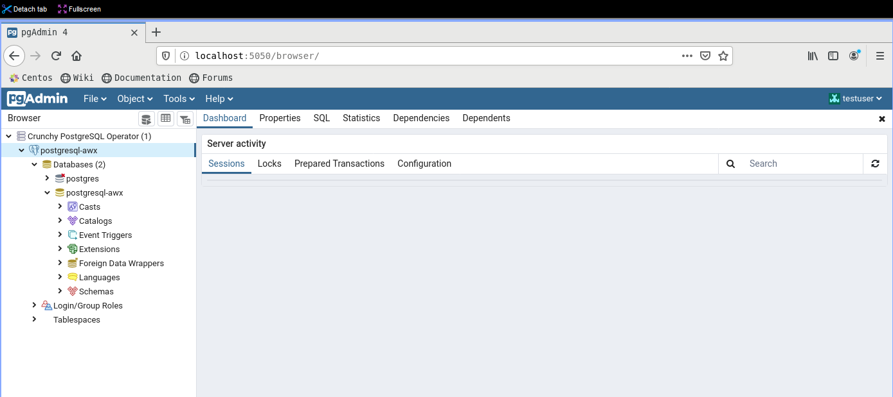

# Installing AWX on Rancher / K3OS

## Deploy PostgreSQL Operator

Reference : https://access.crunchydata.com/documentation/postgres-operator/latest/quickstart/

```shell
kubectl create namespace pgo
kubectl apply -f https://raw.githubusercontent.com/CrunchyData/postgres-operator/v4.6.0/installers/kubectl/postgres-operator.yml
```

Installing the client

```shell
curl https://raw.githubusercontent.com/CrunchyData/postgres-operator/v4.6.0/installers/kubectl/client-setup.sh > client-setup.sh
chmod +x client-setup.sh
/client-setup.sh
```

Adding stuff in `.bashrc`

```bash
cat <<EOF >> ~/.bashrc
export PGOUSER="${HOME?}/.pgo/pgo/pgouser"
export PGO_CA_CERT="${HOME?}/.pgo/pgo/client.crt"
export PGO_CLIENT_CERT="${HOME?}/.pgo/pgo/client.crt"
export PGO_CLIENT_KEY="${HOME?}/.pgo/pgo/client.key"
export PGO_APISERVER_URL='https://127.0.0.1:8443'
export PGO_NAMESPACE=pgo
EOF

source ~/.bashrc
```

Validate if the deployement of the operator is ok

```shell
kubectl -n pgo get deployments
kubectl -n pgo get pods
```

Now forward the port to be able to use the client tool

`kubectl -n pgo port-forward svc/postgres-operator 8443:8443&`

Trying the client

`pgo version`

Creating the DB for AWX :)

`pgo create cluster -n pgo postgresql-awx`

Testing the DB

`pgo test -n pgo postgresql-awx`


Adding pgadmin to administer the DB

`pgo create pgadmin -n pgo postgresql-awx`

Forward the port to access it via firefox

`kubectl -n pgo port-forward svc/postgresql-awx-pgadmin 5050:5050&`

Export Display

`export DISPLAY:MYIP:1.0`

I run firefox from my Centos Server and use remote display to see firefox from the server.
I'm using mobexterm with xserver started.


