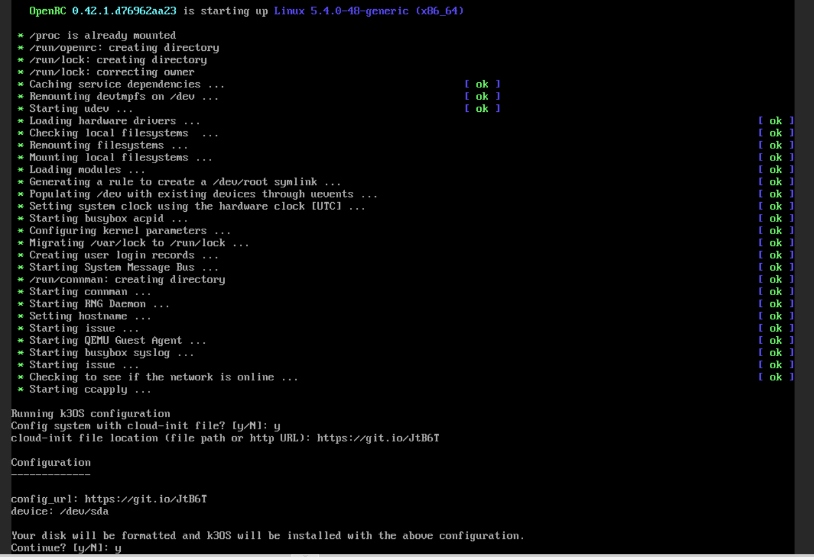

# k3os with proxmox

Using cloud-init workaround with k3os.

To find the right VM id `qm list`

**TBD**
Possibility to force a cloud-init method that is not compatible with the official one.
```
mkdir -p /var/lib/vz/snippets
cp -p k3os-01-config.yaml /var/lib/vz/snippets/
qm set <id> --cicustom user=local:snippets/k3os-01-config.yaml
```

For now I will use tiny url during the boot process, manually...



## Setup 3 Master 3 Node

MASTER-1 : https://git.io/JtBK5
MASTER-2 : https://git.io/JtBKF
MASTER-3 : https://git.io/JtBKj
NODE-1 : https://git.io/JtB6f
NODE-2 : https://git.io/JtB6J
NODE-3 : https://git.io/JtB6U

## Setup only 3 master no node:

MASTER-1 : https://git.io/JtB6T
MASTER-2 : https://git.io/JtB6k
MASTER-3 : https://git.io/JtB6I

# Installing Rancher on K3os

Need helm and kubectl

Install cert-manager

Creating the namespace
`kubectl create namespace cert-manager`

Adding helm repository
`helm repo add jetstack https://charts.jetstack.io`
Update the repo
`helm repo update`

Installing cert-manager

```shell
helm install \
  cert-manager jetstack/cert-manager \
  --namespace cert-manager \
  --version v1.1.0 \
  --set installCRDs=true
```

Validating the installation

`kubectl get pods --namespace cert-manager`

Installing Rancher on K3os :)

Add the latest Rancher Helm repo
`helm repo add rancher-latest https://releases.rancher.com/server-charts/latest`

Create the namespace
`kubectl create namespace cattle-system`

Install rancher with self-signed cert.

```shell
helm install rancher rancher-latest/rancher \
  --namespace cattle-system \
  --set hostname=rancher-meta.mooo.com
```

Keep an eye on the deployement
`kubectl -n cattle-system rollout status deploy/rancher`

State of the deployement
`kubectl -n cattle-system get deploy rancher`